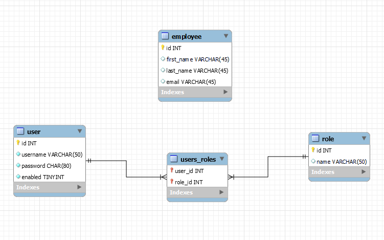
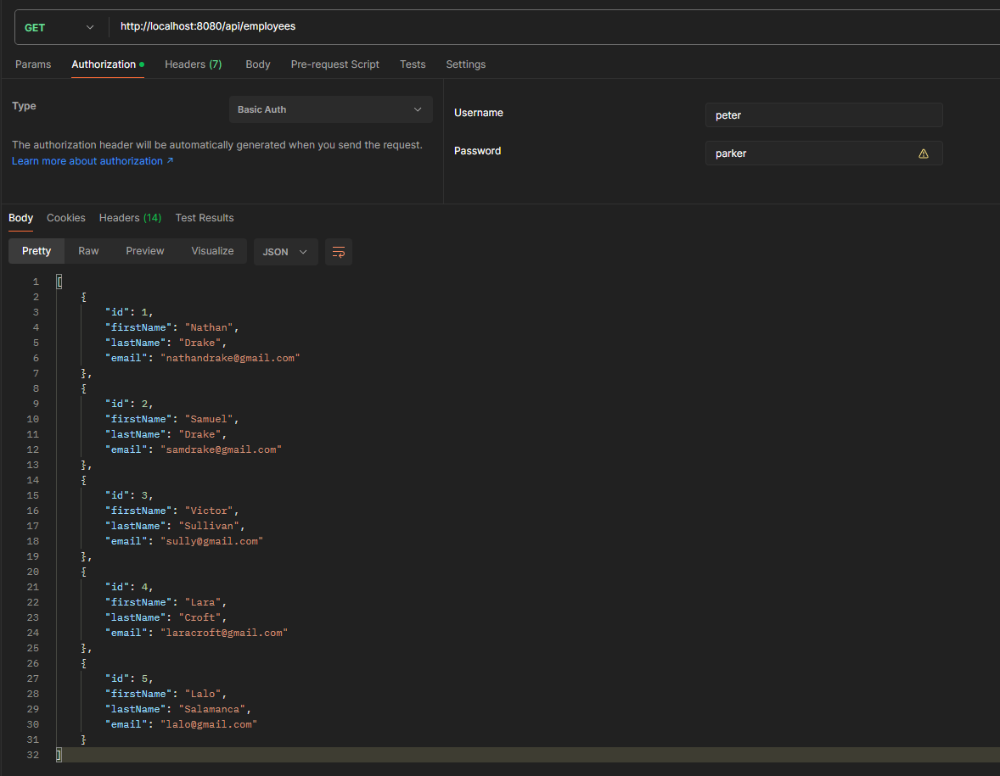
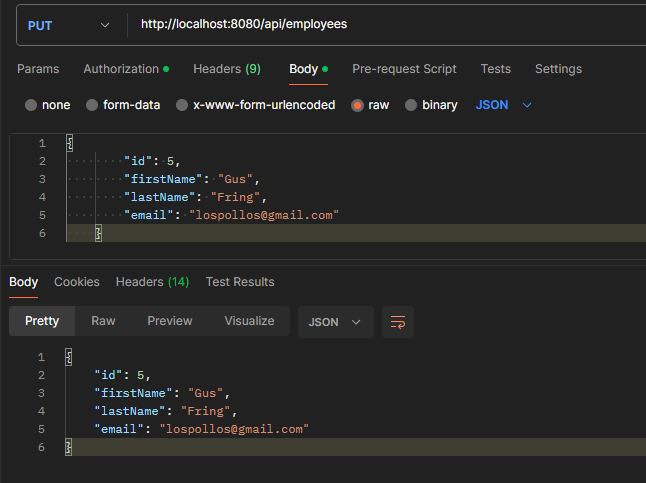

# Spring Boot 3 REST API
- **with Spring Security - Basic Authentication**
- **CRUD implementation using Hibernate/JPA ORM**
- **using JDBC for database interaction**
- **Security handled through Hibernate/JPA**
- **Custom exception handling**

Developed on:
- Java Version: 18.0.2.1
- Spring Boot: 3.2.2
- Package Manager: Maven (https://start.spring.io/)
- Dependencies:
    1. Spring Web: For building web, including RESTful, applications using Spring MVC. Uses Apache Tomcat as the default embedded container.
    2. Spring Data JPA: Persist data in SQL stores with Java Persistence API using Spring Data and Hibernate.
    3. MySQL Driver: MySQL JDBC driver.
    4. Spring Boot Dev Tools: Provides fast application restarts, LiveReload, and configurations for enhanced development experience.
    5. Spring Security: Highly customizable authentication and access-control framework for Spring applications.

# How to run -- Installation
- To run this project, you need to have Java installed on your system.
- Spring Boot 3.2.2 requires at least Java 17 or above.
  
  
- Once you have installed the right version of Java, you can follow these steps:

1. Clone the repository.
2. Use the SQL scripts in the repository to set up the employee table in MySQL.
3. In `src/main/resources/application.properties`, connect to your MySQL database by changing these three parameters:
    ```
    spring.datasource.url=jdbc:Insert Link Here
    spring.datasource.username=Insert Username Here
    spring.datasource.password=Insert Password Here
    ```
4. Run `RestcrudApplication.java`.
5. The default port is `8080`.
6. Use a client tool like Postman to make the API calls.
7. Check below for the various API methods implemented and how to use them.

# NOTE
You can create your own databse table directly on MySQL Workbench(Skip step 2).  
Step 3 is still necessary to establish a database connection.  
OPTIONAL: Use this in ``application.properties`` to autocreate the table from java code: ``spring.jpa.hibernate.ddl-auto=create``   
**Make sure to change the entity name to your table name, and other subsequent updates(objects and methods related to that entity/class)**

# API Requirements
A REST API for the Employee Directory 

REST clients should be able to:   
- Get a list of employees
- Get a single employee by id
- Add a new employee
- Update an employee
- Delete an employee
  
Main resource / entity: **employees**

**HTTP methods to assign action on resource**

| HTTP Method | Endpoint | CRUD Action|  
|----------|----------|----------|  
| POST    |/api/employees| Create a new entity    |  
| GET   |/api/employees| Read a list of entities   |  
| GET   |/api/employees/{employeeId}| Read a single entity    |
| PUT    |/api/employees| Update an existing entity    |  
| DELETE    |/api/employees/{employeeId}| Delete an existing entity    |  

For POST and PUT make sure the body sent is in JSON format.

# Security
**Authentication Scheme used:** Basic Authentication, a simple authentication scheme built into the HTTP protocol.  
The client sends HTTP requests with the Authorization header that contains the word Basic followed by a space and a   
base64-encoded string username:password  
  

**Password stored in the database is encrypted using BCrypt algorithm**

Three layers of security is implemented based on:
- EMPLOYEE
- MANAGER
- ADMIN   
  

  | User ID | Password | Roles                  |
  |---------|----------|------------------------|
  | peter   | parker   | EMPLOYEE               |
  | mary    | jane     | EMPLOYEE, MANAGER      |
  | harry   | osborn   | EMPLOYEE, MANAGER, ADMIN |

| HTTP Method | Endpoint                       | CRUD Action     | Role      |
|-------------|--------------------------------|-----------------|-----------|
| GET         | /api/employees                 | Read all        | EMPLOYEE  |
| GET         | /api/employees/{employeeId}    | Read single     | EMPLOYEE  |
| POST        | /api/employees                 | Create          | MANAGER   |
| PUT         | /api/employees                 | Update          | MANAGER   |
| DELETE      |/api/employees/{employeeId}     | Delete employee | ADMIN     |

# Database EER Diagram


## Tables 
Table: employee  

| id   | first_name | last_name | email                 |
|------|------------|-----------|-----------------------|
| 1    | Nathan     | Drake     | nathandrake@gmail.com |
| 2    | Samuel     | Drake     | samdrake@gmail.com    |
| 3    | Victor     | Sullivan  | sully@gmail.com       |
| 4    | Lara       | Croft     | laracroft@gmail.com   |
| 5    | Lalo       | Salamanca | lalo@gmail.com        |

Table: user

| id   | username | password | enabled |
|------|----------|----------|---------|
| 1    | peter    | $2a$10$CDS9AvXvbLnKky4MO3KmgeZGdBSXsZQU6QxKqUqfMj2Os.NC2sA2C    | 1       |
| 2    | mary     | $2a$10$8N00SjMPB58fOUkZGtecKuJZnpUirqN2rODK7S1vMU5MrEcCsnAYW    | 1       |
| 3    | harry    | $2a$10$DAGpObGwTq1TO/ULTffeJ.n5OAHZ/rNIH5LvOMOkeQlGqHPSCzpFO | 1       |

Table: role

| id | name          |
|----|---------------|
| 1  | ROLE_EMPLOYEE |
| 2  | ROLE_MANAGER  |
| 3  | ROLE_ADMIN    |

Table: user_roles

| user_id | role_id |
|---------|---------|
| 1       | 1       |
| 2       | 1       |
| 3       | 1       |
| 2       | 2       |
| 3       | 2       |
| 3       | 3       |


# Postman, API calls and expected Output

- Make sure you select Authorization Type as **Basic Auth** 
- Body should be in **Raw - JSON** format
- Perform GET calls after every POST, PUT and DELETE actions to check the updated database


## GET : List of Employees

## GET : Single Employee

## POST

## PUT 

## DELETE : Single Employee

## Performing Unauthorised calls
Username: peter only has EMPLOYEE level access. As such, performing ADMIN level actions(DELETE) will throw a **403 Forbidden** status code.  


# Application Architecture
[EMPLOYEE REST CONTROLLER] <--> [EMPLOYEE SERVICE] <--> [EMPLOYEE DAO] <--> [DATABASE]   

Any other DAOs'(Skills DAO, Payroll DAO, etc...) can be connected to Employee Service.
# Future builds?
Rest Controller, Employee Service and Employee DAO layers can be eliminated, and replaced by **Spring Data REST** & **Spring Data JPA**.  
Project: https://github.com/SumantaKS/REST-API-CRUD-Spring-Data-REST-and-JPA  
This will reduce boilerplate codes, but at the cost of custom implementation of Business Logic, Rest Controller and database interaction methods.   
Will implement LogIn interface with new user role registration in the future

